<p align="center">
  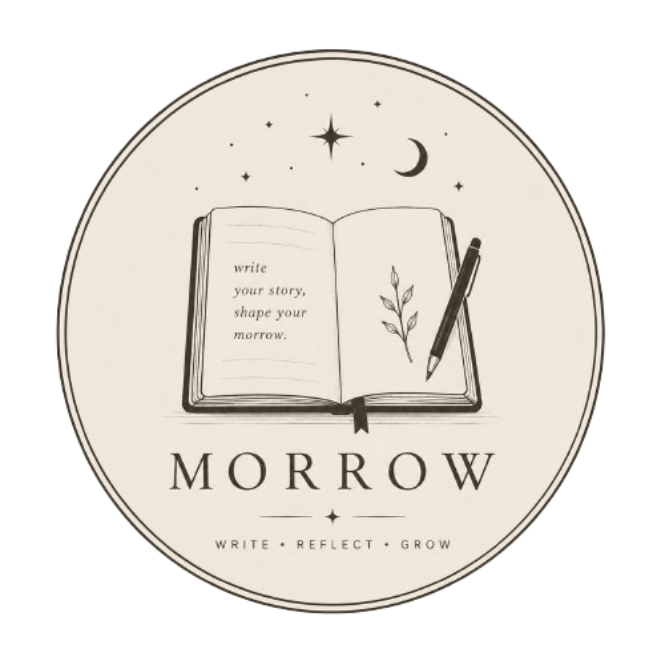
</p>

<h1 align="center">Morrow</h1>

<p align="center">
  <em>Your story, written softly.</em><br />
  A quiet notebook for thoughts, moods, music, and becoming.
</p>

---

<p align="center">
  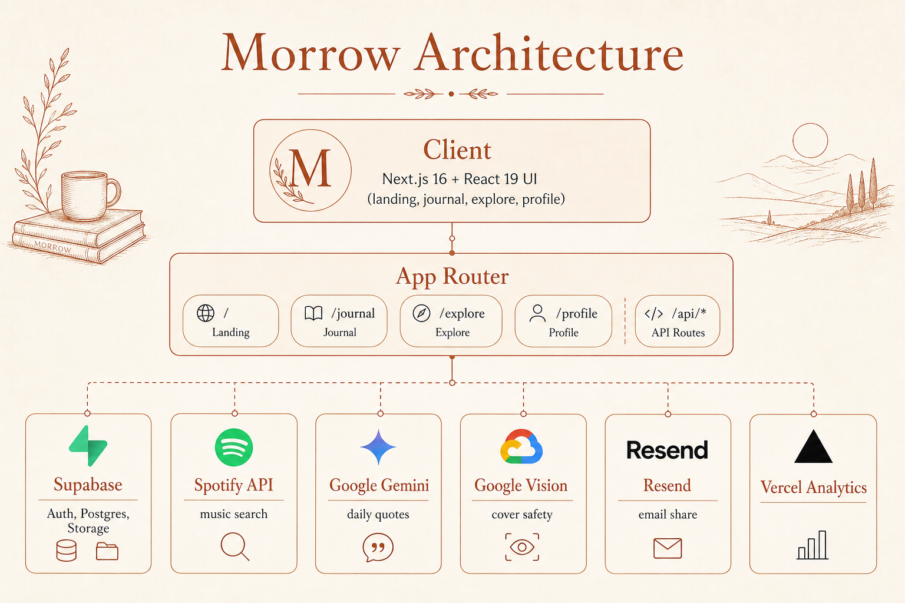
</p>

<p align="center">
  <sub>Next.js · Supabase · Spotify · Gemini · Vision · Resend · Vercel</sub>
</p>

---

## App

<table>
  <tr>
    <td width="50%" align="center">
      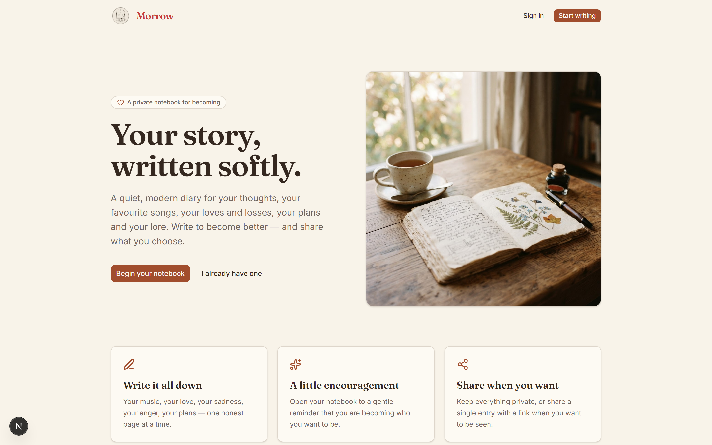
      <br /><sub>Landing</sub>
    </td>
    <td width="50%" align="center">
      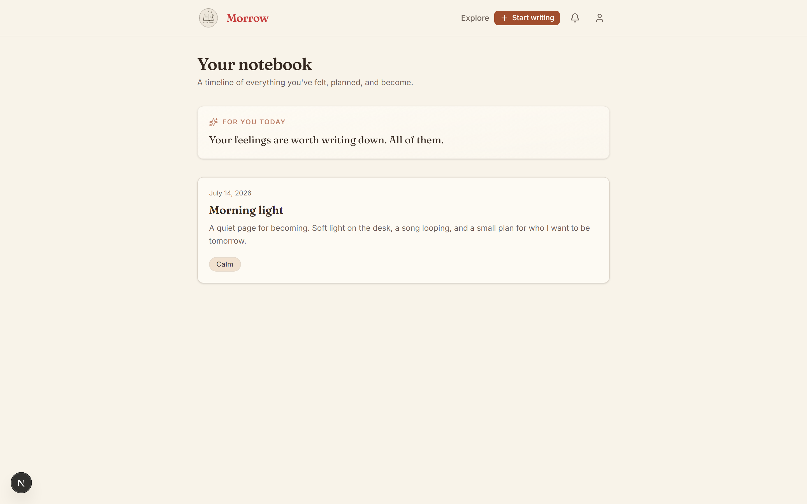
      <br /><sub>Your notebook</sub>
    </td>
  </tr>
  <tr>
    <td width="50%" align="center">
      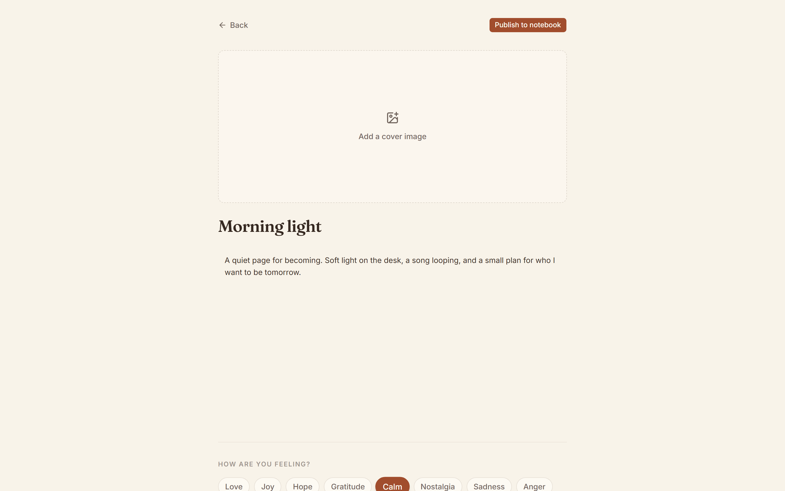
      <br /><sub>Write an entry</sub>
    </td>
    <td width="50%" align="center">
      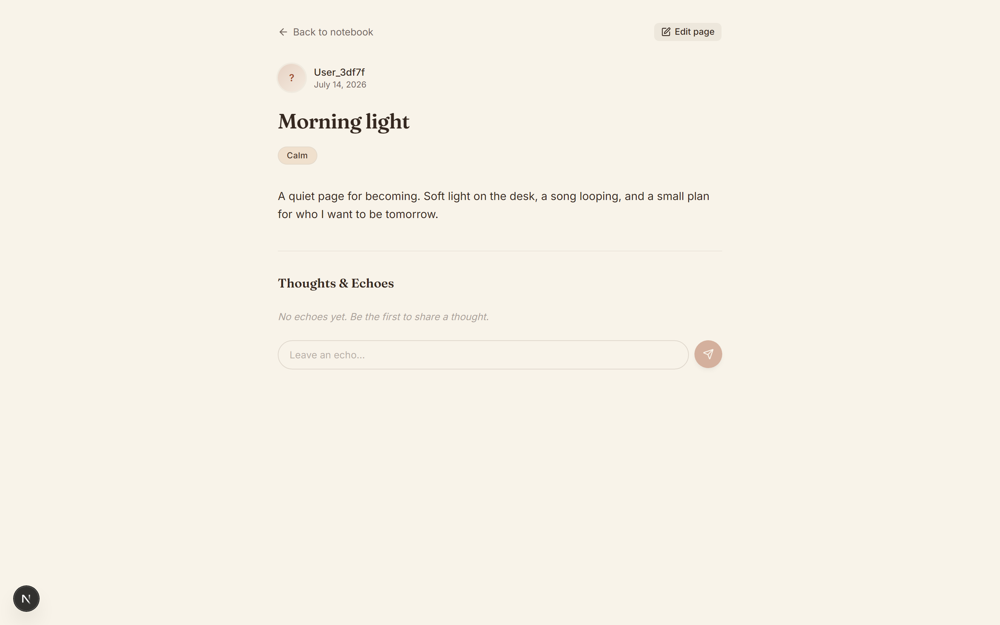
      <br /><sub>Read a page</sub>
    </td>
  </tr>
  <tr>
    <td width="50%" align="center">
      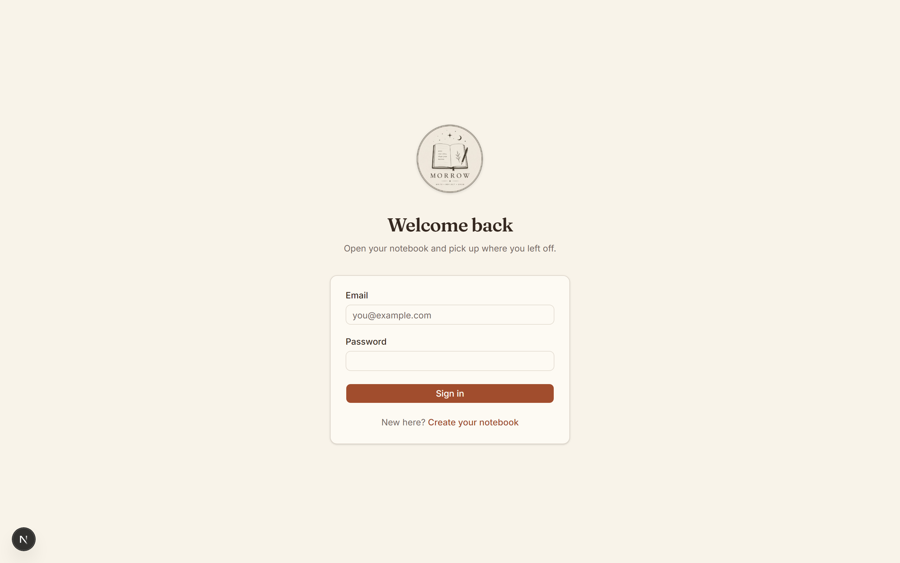
      <br /><sub>Sign in</sub>
    </td>
    <td width="50%" align="center">
      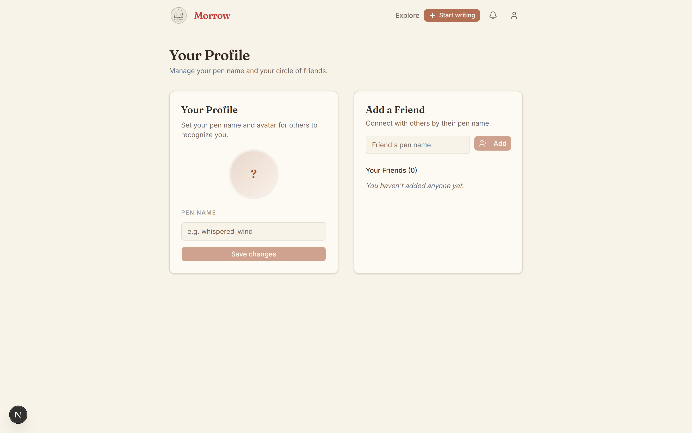
      <br /><sub>Profile & friends</sub>
    </td>
  </tr>
  <tr>
    <td width="50%" align="center">
      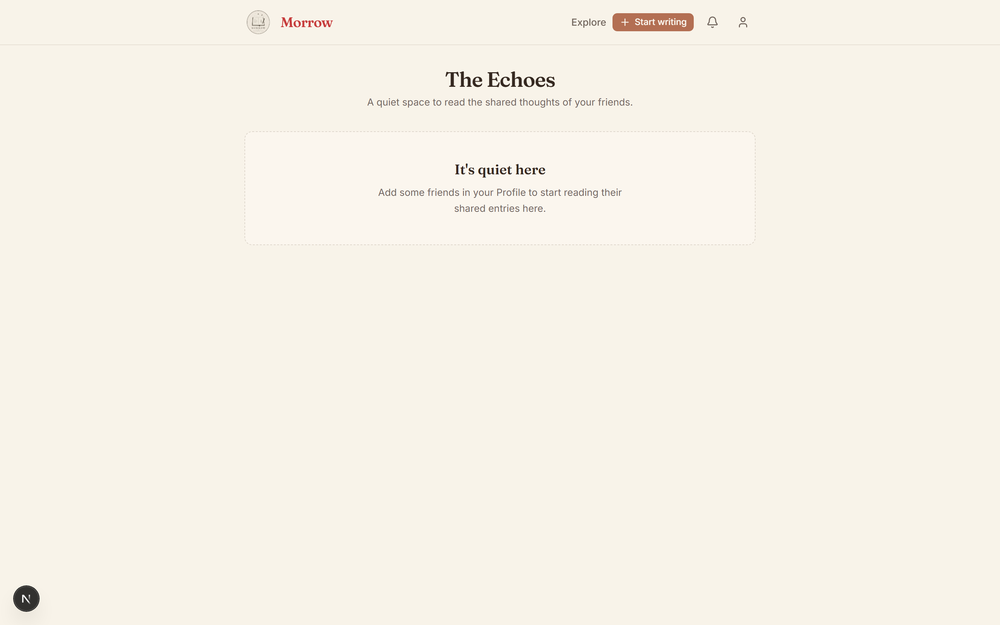
      <br /><sub>The Echoes</sub>
    </td>
    <td width="50%" align="center">
      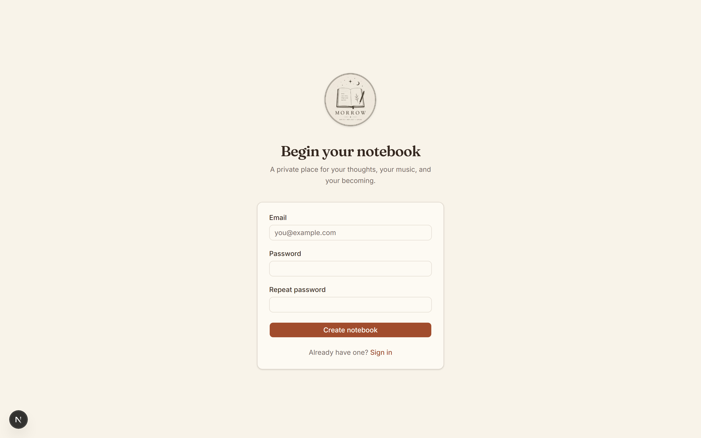
      <br /><sub>Create notebook</sub>
    </td>
  </tr>
</table>

<p align="center">
  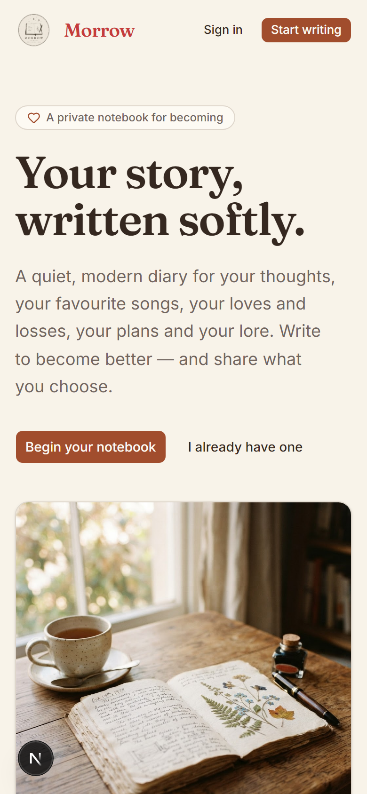
  <br /><sub>Mobile</sub>
</p>

---

## What you can do

- Write pages with **mood**, **cover**, and a **Spotify** song  
- Keep private — or share via **link**, **email**, or **friends**  
- Read friends’ shares in **The Echoes**  
- Soft **Gemini** quotes from your recent writing  
- Cover uploads checked by **Google Vision**  
- Notifications for friend requests & comments  

---

## Tech stack

<p align="center">
  
</p>

<p align="center">
  
  
  
  
  
  
</p>

| | | Role |
|:---:|---|---|
|  | **Supabase** | Auth · Postgres · cover storage |
|  | **Spotify** | Track search + album art |
|  | **Resend** | Email a shared page |
|  | **Google Gemini** | Personalized encouragement |
|  | **Google Vision** | Safe Search on uploads |
|  | **Next.js 16** | App Router · Server Actions |
|  | **Vercel** | Hosting · Analytics |

---

## Getting started

```bash
npm install
npm run dev
```

Open [http://localhost:3000](http://localhost:3000).

```bash
NEXT_PUBLIC_SUPABASE_URL=
NEXT_PUBLIC_SUPABASE_ANON_KEY=
NEXT_PUBLIC_APP_URL=http://localhost:3000

RESEND_API_KEY=
SPOTIFY_CLIENT_ID=
SPOTIFY_CLIENT_SECRET=
GEMINI_API_KEY=
GOOGLE_CLOUD_API_KEY=
```

Re-shoot screenshots:

```bash
npm run dev
node scripts/capture-readme.mjs
```

---

## Vibecode with AI agent :)

Feel first, then wire the stack.

```text
warm parchment · serif titles · calm empty states
  → land · auth · notebook · editor · share
  → Supabase · Spotify · Gemini · Vision · Resend
  → polish · capture → public/readme/
```

---

<p align="center">
  <br />
  <strong>Morrow</strong> — a quiet place for your story.
</p>
